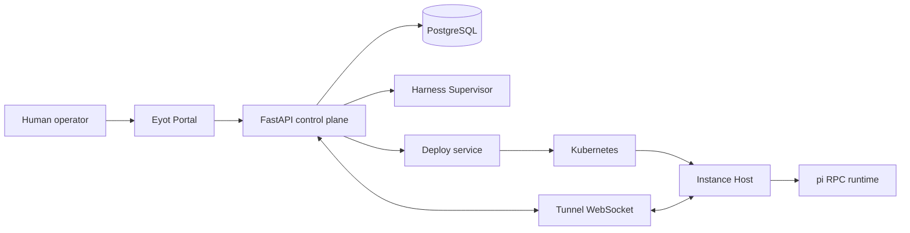

<div align="center">
  <h1>Eyot</h1>
  <p><strong>Give every agent a place to work.</strong></p>
  <p>
    A K8s-native control studio for agents that remember work,
    collaborate through explicit links, and run as inspectable pods.
  </p>
  <p>
    <a href="https://github.com/Cyame/eyot.ai"></a>
    <a href="https://github.com/Cyame/eyot.ai/blob/main/LICENSE"></a>
    
    
    
  </p>
  <p>
    <a href="#get-started">Get started</a>
    ·
    <a href="#features">Features</a>
    ·
    <a href="#deploy-to-orbstack">Deploy</a>
    ·
    <a href="#development">Development</a>
  </p>
</div>

Eyot is the control plane between a human operator and a working population of
agents. It gives an agent a persistent identity, a bounded workspace, explicit
neighbors, durable memory, and a real runtime you can inspect or restart.

The name comes from an eyot, a small island in a river. E·Y·O·T stands for
Entity, Yoke, Organization, and Topology.

It is not a chat window with a larger prompt. The basic loop is:

```text
choose a role  ->  shape an identity  ->  run an instance  ->  keep the lesson
    BaseClass          Entity                 Instance             Memory
```

## Features

<table>
  <tr>
    <td width="50%" valign="top">
      <h3>Persistent agent identity</h3>
      <p>A <code>BaseClass</code> defines a reusable role. An <code>Entity</code> gives that role a scenario-specific identity and shared memory. An <code>Instance</code> materializes it in one workspace.</p>
    </td>
    <td width="50%" valign="top">
      <h3>Explicit collaboration</h3>
      <p>Agents do not disappear into a broadcast bus. <code>Passage</code> edges define who can reach whom, while Composer turns, slash directives, and streamed responses make the exchange inspectable.</p>
    </td>
  </tr>
  <tr>
    <td width="50%" valign="top">
      <h3>Real runtime, not a fake status badge</h3>
      <p>Each Instance can run in its own pod through <code>eyot-instance-host</code>, a Tunnel WebSocket, and a pi RPC bridge. Pause, resume, interrupt, restart, and snapshot are control-plane operations.</p>
    </td>
    <td width="50%" valign="top">
      <h3>Memory that can become capability</h3>
      <p>Learning actions turn runtime experience into reusable capability and new roles: reap, promote, transmute, combine, and distill. The system keeps the identity chain and the capability chain separate.</p>
    </td>
  </tr>
  <tr>
    <td width="50%" valign="top">
      <h3>One workspace for the whole operation</h3>
      <p>The portal brings together topology, Composer, events, CentralHub, Fornix, Vault, knowledge, providers, and instance lifecycle controls instead of scattering them across tools.</p>
    </td>
    <td width="50%" valign="top">
      <h3>Deploy and observe the same object</h3>
      <p>The backend records a nine-step Kubernetes deployment, streams progress over SSE, emits audit events, and exposes harness state and circuit-breaker snapshots for inspection.</p>
    </td>
  </tr>
</table>

## What is here now

Eyot is pre-1.0. The current application version is `0.5.3`.

| Surface | Current state |
|---|---|
| Auth, Organizations, Namespaces, and permission atoms | Shipped |
| BaseClass, Entity, Instance lifecycle | Shipped |
| Workspace topology, Membership, Passage, and Composer | Shipped |
| CentralHub, Fornix, Vault, knowledge, and scheduled work | Shipped |
| Provider configuration and model catalog | Shipped |
| Harness controls, event stream, deployment records, and Tunnel | Shipped |
| Learning write-back and capability market | Shipped |
| Portal visual refresh, themes, avatars, density, and empty states | Shipped in `0.5.3` (user visual review) |
| Session-engine v2 multimodal protocol, Voice, and external channels | Later |

The project is deliberately narrower than a general agent platform. The
current focus is a useful control plane with a clear runtime boundary, not a
catalog of every possible integration.

## How it fits together

### The product model

The backend keeps stable technical names. The portal uses a geography and
animal vocabulary for the same objects:

| Backend term | Portal term | Meaning |
|---|---|---|
| `Organization` | Continent (大陆) | Top-level tenant boundary |
| `Namespace` | Region (区域) | Scenario partition |
| `Workspace` | Habitat (生境) | Concrete workstream |
| `BaseClass` | Ancestor (始祖) | Reusable role template |
| `Entity` | Bloodline (血脉) | Persistent scenario identity |
| `Instance` | Descendant (后裔) | Running materialization in a workspace |
| `Passage` | Wild path (兽道) | Explicit neighbor edge |
| `Topology` | Territory map (领地地图) | Live spatial view of a workspace |

### The runtime boundary



The Portal, API, Harness Supervisor, deployment service, events, and topology
form the Workspace control plane. Each Instance is a separate runtime boundary
and communicates with the backend through the host bridge and Tunnel protocol.

## Get started

### Prerequisites

- Python 3.12 or newer
- [`uv`](https://docs.astral.sh/uv/)
- [Bun](https://bun.sh/) 1.2 or newer
- PostgreSQL 16 or newer
- Docker only if you want the disposable PostgreSQL fallback or a K8s deploy

### Local development

From the repository root:

```bash
# Create the development database once.
psql -U postgres -h 127.0.0.1 -c "CREATE DATABASE eyot_dev;"

# Configure the backend.
cd eyot-backend
cp .env.example .env
# Set DATABASE_URL, JWT_SECRET, and ENCRYPTION_KEY in .env.
uv sync
uv run alembic upgrade head
cd ..

# Start the backend on :4510 and the portal on :5173.
./dev.sh
```

Open the Portal at [`http://localhost:5173`](http://localhost:5173). The API
docs are at [`http://localhost:4510/docs`](http://localhost:4510/docs).

`./dev.sh` installs missing backend and Portal dependencies automatically. Use
`./dev.sh --fresh` when you intentionally need to rebuild `.venv` and
`node_modules`.

On startup, the backend idempotently seeds the default Organization, Namespace,
built-in Ancestors, permission atoms, and command capabilities. Tests use
separate `eyot_test_*` databases and never touch `eyot_dev`.

## Deploy to OrbStack

The live inspection environment is an OrbStack Kubernetes cluster. The deploy
script updates the existing `eyot` namespace in place, runs Alembic against the
cluster database, performs a health check, and leaves the namespace running.

Check the context before changing anything:

```bash
kubectl config current-context
kubectl config use-context orbstack
```

Build the backend and Portal images from the repository root. Then build and
push the Instance image family used by the deploy service:

```bash
docker build \
  -t eyot-backend:latest \
  -f eyot-artifacts/docker/Dockerfile.backend .

docker build \
  -t eyot-portal:latest \
  -f eyot-artifacts/docker/Dockerfile.portal .

./scripts/build-instance-images.sh --push
./scripts/deploy-to-orbstack.sh
```

The Instance build produces one base image and five Ancestor layers:
`fox`, `beaver`, `sparrow`, `coyote`, and `lion`. The deploy script does not
build these images for you; it checks that they already exist before applying
the manifests.

Useful inspection commands:

```bash
./scripts/deploy-to-orbstack.sh --status
./scripts/deploy-to-orbstack.sh --logs
```

Do not delete the `eyot` namespace. It is the persistent environment used for
human inspection.

## Development

### Backend

```bash
cd eyot-backend
uv run pytest -q
uv run ruff check .
uv run alembic revision --autogenerate -m "describe the schema change"
uv run alembic upgrade head
```

The test suite creates a session template and clones a private database for
each test. Never put an `eyot_dev` connection string in test code.

### Portal

```bash
cd eyot-portal
bun install
bun run type-check
bun run lint
bun run test
bun run build
```

### Instance Host

The Host is the outbound WebSocket client and pi RPC bridge used inside an
Instance pod.

```bash
cd eyot-instance-host
npm install
npm test
npm run build

EYOT_API_URL=http://localhost:4510 \
EYOT_INSTANCE_ID=<instance-uuid> \
EYOT_PROXY_TOKEN=<instance-proxy-token> \
npm start
```

See [`eyot-instance-host/README.md`](eyot-instance-host/README.md) for the
complete environment variable reference.

## Repository map

```text
eyot/
├── eyot-backend/        FastAPI API, domain models, harness, learning, deploy
├── eyot-portal/         React operator console and topology UI
├── eyot-instance-host/  Per-instance Tunnel client and pi RPC bridge
├── eyot-artifacts/      Dockerfiles and Kubernetes manifests
├── assets/              Preset and visual source assets
├── docs/                Product roadmap, terminology, API, and observability
├── scripts/             OrbStack deploy and Instance image tooling
├── dev.sh               One-command local development launcher
├── RELEASE_NOTES.md     Versioned release notes
└── AGENTS.md            Local contributor and agent rules
```

## Read next

- [System roadmap and blueprint](docs/roadmap.md)
- [Product terminology](docs/terminology.md)
- [Metaphor name table](docs/metaphor-name-table.md)
- [API architecture](docs/api-architecture.md)
- [Observability conventions](docs/observability.md)
- [Backend development notes](eyot-backend/README.md)
- [Instance Host environment and protocol](eyot-instance-host/README.md)
- [Release notes](RELEASE_NOTES.md)

## License

[Apache License 2.0](LICENSE)
